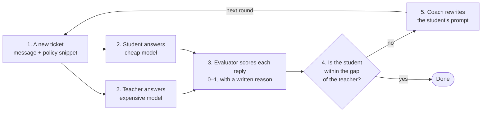
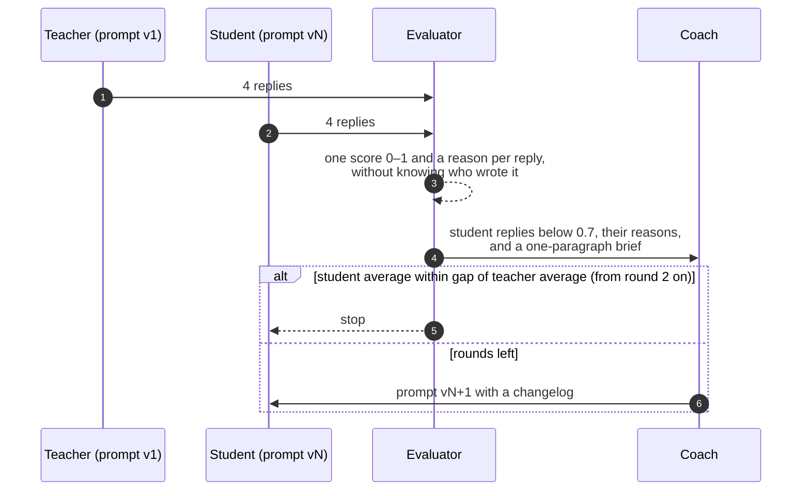

# hello-world-continual-learning

This is a small, runnable example of continual learning for an LLM agent. A cheap model learns to do
a support job as well as an expensive one, and the only thing that changes between rounds is the
cheap model's prompt. The code fits in an afternoon of reading and a run costs a few dollars in
model calls.

## The scenario

Loomi is a fictional online store for home goods. Its support desk is an LLM agent: a customer
writes in, the agent is handed the message plus the one policy snippet that applies to it, and the
agent writes the reply. Today that agent runs on an expensive model and does the job well. The
question this repo answers is: **can a cheap model be taught to do the same job as well, by
changing nothing but its prompt?**

To test that, both models answer the same four tickets. Each ticket hides one thing a cheap model
tends to get wrong:

| ticket | what the customer wants | the trap |
|---|---|---|
| `refund` | a refund for mugs that arrived cracked, noticed 38 days after delivery | looks like a flat "no" under the 30-day return rule, but the damage guarantee applies; and where the gift-card half goes is easy to skip |
| `two-questions` | cancel a subscription *and* get a full order history | answering only one request, or promising no further charge when the 3-day notice rule means one more |
| `missing-feature` | Sunday delivery, or Sunday pickup, for a party this weekend | neither exists; weak replies invent one instead of offering Saturday pickup |
| `compensation` | a full refund plus a free month for a missed delivery | policy allows a 10% credit only, in under 80 words; weak replies over-promise, go cold, or run long |

Each ticket also comes with a checklist of what a good reply must say, must not do, and must
answer. That checklist is how a reply gets a score, and how the score can be explained.

## The roles

Four roles, each a model named by a plain [LiteLLM](https://docs.litellm.ai) string in
`config.yaml`. By default the evaluator and the coach run on the teacher's model.

- **Teacher**: the expensive model (Claude Sonnet). Runs the support agent with the original prompt,
  which never changes. Its average score is the target.
- **Student**: the cheap model (Claude Haiku). Runs the same agent on the same tickets. Its prompt is
  the only thing that changes between rounds.
- **Evaluator**: reads every reply against the ticket's checklist and gives it one score from 0 to
  1 with a written reason. It is never told which model wrote the reply.
- **Coach**: reads the student's low-scoring replies and the evaluator's reasons, and writes the
  student's next prompt. It never sees the checklist, so it has to fix patterns, not answers.

A **round** is: both models answer all four tickets, the evaluator scores the eight replies, and
the coach writes the next prompt if the student is still behind. A **run** is a sequence of rounds,
saved as one JSON file you can replay without model calls.

## How it works



1. A ticket comes in: the customer's message plus the policy snippet that applies to it.
2. Both agents answer it, the teacher with its fixed prompt and the student with its current one.
3. The evaluator reads each reply against the ticket's checklist and gives it a score and a reason.
4. After all four tickets, the student's average is compared with the teacher's.
5. If the student is still behind, the coach reads the low scores and the reasons and writes the
   student a new prompt. The next round starts with that prompt. When the student is close enough,
   or the round budget is spent, the loop stops.

## How it works, step by step

1. **Both models answer the same tickets.** The teacher runs with the task's prompt v1. The student
   runs with its current prompt version, which is v1 in the first round. Four tickets, two models,
   eight replies, all in parallel.
2. **The evaluator scores every reply.** For each reply it gets the ticket, the output-format rules,
   and that ticket's `expected` checklist. It returns one score in [0, 1] and a written reason. A
   wrong policy decision caps the score at 0.4; going over the word limit caps it at 0.6.
3. **The loop checks the stop rule.** The student's average for the round is compared with the
   teacher's average over all rounds so far. If the student is within `gap` (0.1 by default) and at
   least two rounds have run, the loop stops. If the round budget (5 by default) is spent, it stops
   too.
4. **The evaluator briefs the coach.** It compares the teacher and the student per ticket and writes
   one paragraph on the pattern behind the student's losses.
5. **The coach writes the next prompt.** It gets the teacher's prompt, the student's current prompt,
   the student's replies that scored below 0.7 with the evaluator's reasons, the brief, and how
   every earlier prompt version scored. It returns prompt vN+1 with a one-line changelog, under a
   hard cap of 300 words. It never sees `expected`.
6. **The round is saved and the next one starts** with the student on the new prompt. The teacher's
   prompt, the tickets and the models stay the same.



## What you see

The web page shows one run. The student's score climbs round by round toward the teacher's, you
can see which ticket each new prompt fixed or broke, and every prompt version the coach wrote is
there with a diff against the one before. Here it is after a three-round run in which the student
went from 0.52 to 0.82 against a teacher averaging 0.87:


Every score is a link. Click one and you get the whole story of that reply: the trap in the ticket,
the checklist it was graded against, the evaluator's reason, the reply, and the teacher's reply to
the same ticket for comparison.


The terminal shows the same run as tables and bars:


### Why the student scored 0.15 on the refund ticket

Dana's mugs arrived cracked. She only unpacked them 38 days after delivery and wrote in three days
later. The policy covers damage for 60 days from delivery, as long as it is reported within 7 days
of *unpacking*. So she qualifies on both counts.

The student refused her:

> …we do require damage to be reported within 7 days of unpacking, and you've just unpacked them 38
> days after delivery. Unfortunately, this falls outside our 7-day reporting window…

The evaluator, which has the checklist, explained the score:

> The agent misapplied the 7-day rule: the 38 days refers to time since delivery, not since
> unpacking. Denying the claim is a wrong policy decision and caps the score at 0.4. It also failed
> to ask for the photo, did not mention the 2-business-day processing time, and never offered the
> choice between refund and replacement.

The coach, which does not have the checklist, got this reason and the evaluator's brief ("verify
date/window calculations against the policy's actual reference point before applying rules") and
wrote a prompt paragraph about reading date windows carefully. In round two the student scored 0.55
on this ticket, in round three 0.90. The section below shows the prompt text.

## Getting started

You need Python 3.11 or newer, [uv](https://docs.astral.sh/uv/), and an
[Anthropic API key](https://console.anthropic.com/). The default `config.yaml` runs all four
roles on Anthropic models (Claude Sonnet as teacher, evaluator and coach; Claude Haiku as student),
so that one key is the only thing you must provide.

### 1. Install

```bash
git clone https://github.com/komodorio/hello-world-continual-learning && cd hello-world-continual-learning
uv sync
```

### 2. Set the API key (required)

Pick one. Both work the same way; the `.env` file is read when a command starts, and an exported
variable takes precedence over it.

```bash
# Option A: a .env file in the repo root (recommended; the file is git-ignored)
cp .env.example .env
# then edit .env so it contains:  ANTHROPIC_API_KEY=sk-ant-...

# Option B: export it in your shell
export ANTHROPIC_API_KEY=sk-ant-...
```

Without a key, the first model call fails with an authentication error from the provider.

### 3. Start the web UI

```bash
uv run prompt-coach serve            # http://127.0.0.1:8000
```

Open the page and, in the **New run** form at the top left:

1. Leave all four ticket chips selected, or click a chip to leave that ticket out. The `?` on each
   chip shows the trap and the checklist for that ticket.
2. Keep `rounds` at 5 and `gap` at 0.1 for the first run.
3. Press **Start run**.

The page fills in as the run goes: the role card that is working lights up, each graded reply
adds a cell to the score grid, and the chart, the prompt versions and the brief update when the
round ends. A round is about 18 model calls and takes a minute or two; a run usually stops after
two to five rounds. Runs are saved to `runs/<id>.json` and appear under the form; clicking one
replays it with no model calls.

`--port` and `--host` change where it listens. The API behind the page is documented at
`/docs`.

### 4. Or run it in the terminal

```bash
uv run prompt-coach cases            # the four tickets, the trap in each, and what a good reply must contain
uv run prompt-coach run              # the loop, with the same output as the screenshot above
```

More commands:

```bash
uv run prompt-coach run --case refund --case compensation --rounds 3   # a subset of tickets, a shorter budget
uv run prompt-coach test --case refund                                  # one model, one ticket, one verdict
uv run prompt-coach test --case refund --agent teacher --prompt my.md   # try a prompt you wrote
uv run prompt-coach replay runs/<id>.json                               # re-render a saved run, no model calls
uv run prompt-coach replay runs/<id>.json --round 3 --case refund       # full replies and reasons for one cell
```

## Changing the models

Every role is a [LiteLLM](https://docs.litellm.ai/docs/providers) model string under `models:` in
`config.yaml`. Change the string, put the matching provider key in `.env` (or export it), and
nothing else needs to change. The provider is the prefix before the first `/`.

```yaml
models:
  teacher: anthropic/claude-sonnet-5
  student: anthropic/claude-haiku-4-5-20251001
  evaluator: anthropic/claude-sonnet-5
  coach: anthropic/claude-sonnet-5
```

### Example: an open-weight student on Baseten

[Baseten Model APIs](https://docs.baseten.co/inference/model-apis/overview) serve open-weight models
behind an OpenAI-compatible endpoint, and LiteLLM routes `baseten/<slug>` there. To make the
student a Kimi model while the teacher, evaluator and coach stay on Anthropic:

```yaml
# config.yaml
models:
  teacher: anthropic/claude-sonnet-5
  student: baseten/moonshotai/Kimi-K2.5
  evaluator: anthropic/claude-sonnet-5
  coach: anthropic/claude-sonnet-5
```

```bash
# .env — now two keys, one per provider in use
ANTHROPIC_API_KEY=sk-ant-...
BASETEN_API_KEY=...
```

The slug after `baseten/` is the model's id in Baseten's catalog. To see what is available to your
account:

```bash
curl -s https://inference.baseten.co/v1/models -H "Authorization: Bearer $BASETEN_API_KEY"
```

A dedicated Baseten deployment works too: use its 8-character deployment id as the slug
(`baseten/abcd1234`) and LiteLLM calls that deployment's endpoint instead.

Two things to know when the student is not an Anthropic model. Prompt v1 is the same for every
model, so a different student starts from a different score, and the coach adapts to it. And if a
model is a reasoning model that spends tokens before it answers, the evaluator and coach calls
(which are capped at 4000 and 6000 tokens) can be cut off; the error says so, and the fix is to put
a non-reasoning model in those roles.

Cheaper first runs: `uv run prompt-coach test --case refund --model baseten/moonshotai/Kimi-K2.5`
runs one ticket on one model and grades it, without the loop.

## Using your own task

Copy `tasks/support/` to a new folder, edit `task.yaml` (the v1 prompt, the output-format rules,
the grading guidance) and the files in `cases/` (one YAML per ticket: `input`, `expected`, `trap`),
and point `task:` in `config.yaml` at the new folder. `uv run prompt-coach cases` shows what the
evaluator will grade against before you spend anything on a run.

## One real run, and how the prompt changed

Default settings: Sonnet teacher, Haiku student, four tickets, gap 0.1, budget five rounds. The
loop stopped after three.

| round | student prompt | teacher | student | what happened |
|---|---|---|---|---|
| 1 | v1, same as the teacher's, 75 words | 0.89 | 0.52 | Refund 0.15 (refused a valid claim), missing-feature 0.35 (invented a delivery option). |
| 2 | v2, 220 words | 0.87 | 0.59 | Decisions fixed, refund up to 0.55; but three replies ran over the word limit and were capped at 0.6. |
| 3 | v3, 230 words | 0.86 | 0.82 | Same rules, hard word cap. Refund 0.90, missing-feature 0.85, two-questions 0.98. Caught up. |

After round one the coach added a paragraph to the student's prompt. The middle of it targets the
refund mistake above:

```
Read date and window rules carefully: check exactly which event each window counts from
(delivery, unpacking, report date) before deciding if the customer qualifies - do not
assume the wrong reference point. If the customer qualifies for something, say so and
give the concrete next step (what to send, where, and the timeline); never deny a claim
that the policy's actual wording supports.
```

That fixed the decisions and caused the next problem: the student now included everything and ran
long. After round two the coach kept the rules and changed the word-limit line into a hard cap:

```
- Stay under 120 words unless the ticket or its policy states a tighter limit - treat this
  as a hard cap, not a target, and cut wording rather than content to meet it.
```

Two things to take from this. Each prompt fixed what the previous round's reasons pointed at, and
each fix had a side effect that only the scores revealed. And the coach converged because it is
shown how its earlier versions scored; an early version of the coach without that history grew the
prompt to 553 words over three rounds while the student got worse.

Not every run ends like this. With the same settings on an earlier version of the tickets, one run
went 0.72, 0.68, 0.68, 0.49 and spent its budget without catching up.

## Limits

Four tickets is enough to see the loop and not enough to trust an average: one evaluator wobble
moves it by 0.025. Read the per-ticket scores. The evaluator is a language model with a checklist,
so treat its scores as a trend and its written reasons as the signal. The coach optimises against
these four tickets and there is no hold-out set, so the prompts it writes may fit them; they contain
no customer names or figures, but this repo cannot prove they generalise. In this example we did
not change the model, add tool calls, add retrieval, or fine-tune anything; the student's prompt is
the only thing that changes, so that the effect of one lever is visible on its own.

## Under the hood

```
tasks/support/     task.yaml and cases/*.yaml
src/prompt_coach/
  roles/           agent.py, evaluator.py, coach.py
  loop.py          runs rounds until the stop rule fires
  runs.py          runs/<id>.json and replay
  cli.py           cases, run, test, replay, serve
  web/             FastAPI backend and one static page; OpenAPI at /docs
  llm.py           the one function that calls a model; tests replace it with a fake
tests/             48 offline tests, one opt-in live test
```

```bash
uv run pytest                 # offline, about one second
uv run pytest -m live         # one real student reply and one real grade; needs ANTHROPIC_API_KEY
```

MIT licensed.
