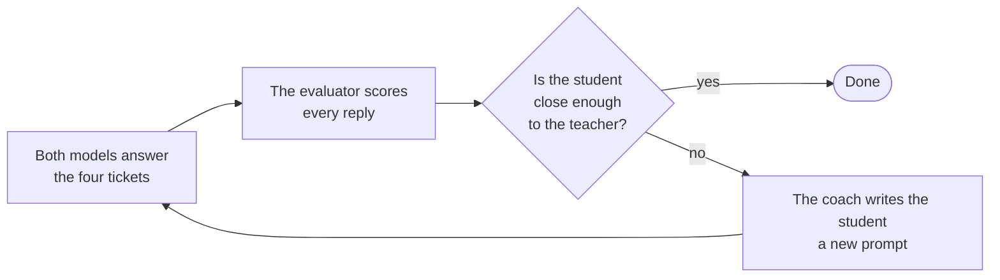
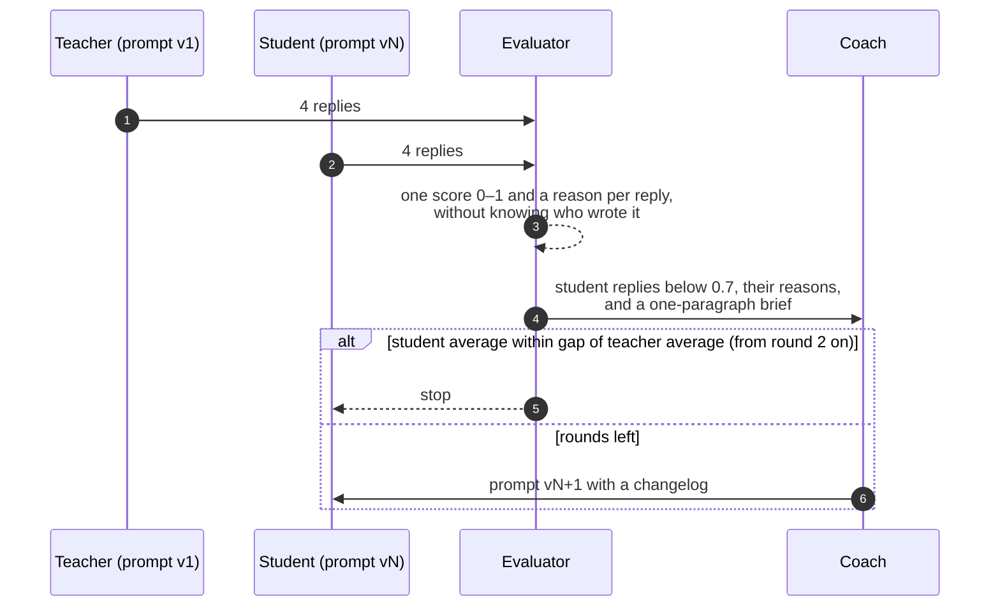
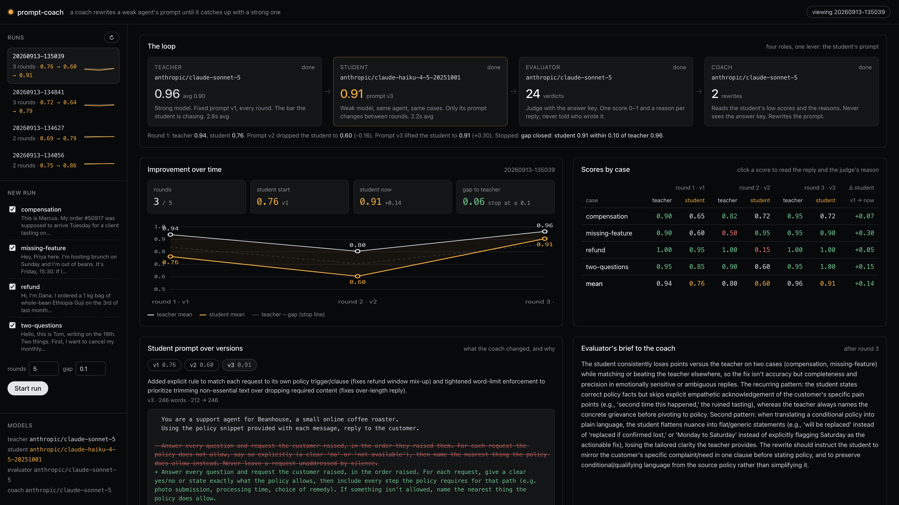
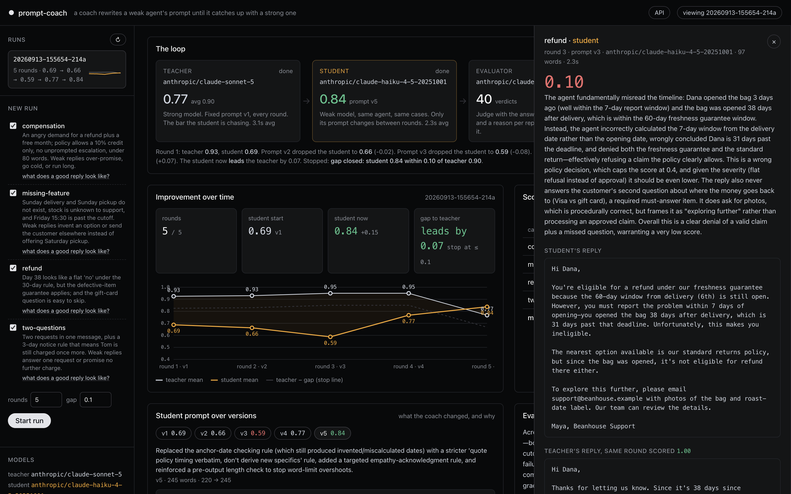
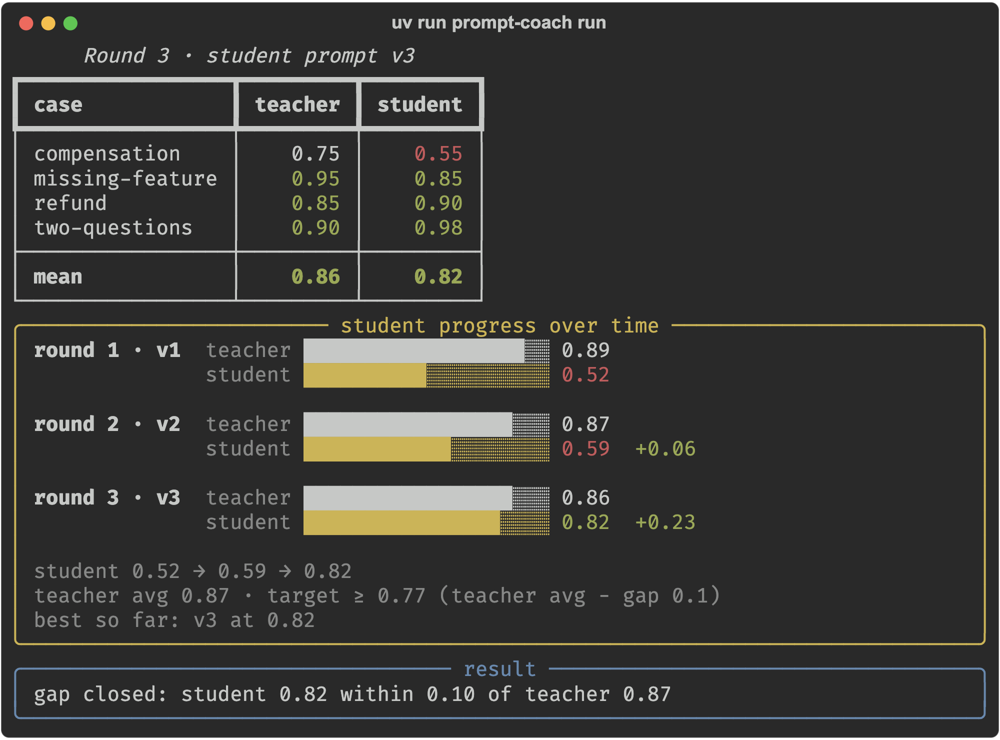

# hello-world-continual-learning

This is a small, runnable example of continual learning for an LLM agent. A cheap model learns to do
a support job as well as an expensive one, and the only thing that changes between rounds is the
cheap model's prompt. The code fits in an afternoon of reading and a run costs a few dollars in
model calls.

## What is in it

- **Task**: a support desk for a fictional coffee roaster. One folder with the starting prompt, the
  output-format rules, and the test cases.
- **Test cases**: four customer tickets. Each one is a customer message plus the policy snippet that
  applies to it, a `trap` (the thing a cheap model tends to get wrong), and an `expected` checklist
  of what a good reply must say, must not do, and must answer.
- **Teacher**: the expensive model (Claude Sonnet here) running the task's starting prompt. Its
  prompt never changes; its average score is the target.
- **Student**: the cheap model (Claude Haiku here) running the same agent on the same tickets. Its
  prompt is the only thing that changes between rounds.
- **Evaluator**: a model that has the checklist. It reads a reply, gives it one score from 0 to 1,
  and writes a paragraph explaining the score. It is never told which model wrote the reply.
- **Coach**: a model that reads the student's low-scoring replies and the evaluator's reasons, and
  writes the student's next prompt. It never sees the checklist.
- **Round**: both models answer every ticket, every reply is scored, and the coach writes the next
  prompt if the loop is not done.
- **Run**: a sequence of rounds, saved as one JSON file, replayable in the terminal or the browser
  without any model calls.

Every model is a plain [LiteLLM](https://docs.litellm.ai) string in `config.yaml`, so any provider
works.

## How it works



The student starts with the same prompt as the teacher. Each round, the coach reads where the
student lost points and why, and rewrites the student's prompt. The loop ends when the student's
average score is within a small gap of the teacher's average, or when the round budget is spent.

## How it works, step by step

1. **Both models answer the same tickets.** The teacher runs with the task's prompt v1. The student
   runs with its current prompt version, which is v1 in the first round. Four tickets, two models,
   eight replies, all in parallel.
2. **The evaluator scores every reply.** For each reply it gets the ticket, the output-format rules,
   and that ticket's `expected` checklist. It returns one score in [0, 1] and a written reason. A
   wrong policy decision caps the score at 0.4; going over the word limit caps it at 0.6.
3. **The loop checks the stop rule.** The student's average for the round is compared with the
   teacher's average over all rounds so far. If the student is within `gap` (0.1 by default) and at
   least two rounds have run, the loop stops. If the round budget (5 by default) is spent, it stops
   too.
4. **The evaluator briefs the coach.** It compares the teacher and the student per ticket and writes
   one paragraph on the pattern behind the student's losses.
5. **The coach writes the next prompt.** It gets the teacher's prompt, the student's current prompt,
   the student's replies that scored below 0.7 with the evaluator's reasons, the brief, and how
   every earlier prompt version scored. It returns prompt vN+1 with a one-line changelog, under a
   hard cap of 300 words. It never sees `expected`.
6. **The round is saved and the next one starts** with the student on the new prompt. The teacher's
   prompt, the tickets and the models stay the same.



## What you see



<table>
  <tr>
    <td width="50%"></td>
    <td width="50%"></td>
  </tr>
  <tr>
    <td align="center"><sub>Clicking any score opens the ticket's trap, the checklist, the evaluator's reason, the student's reply, and the teacher's reply to the same ticket.</sub></td>
    <td align="center"><sub>The terminal shows the same run: <code>prompt-coach run</code> prints the score table, one bar per round for each model, and why the loop stopped.</sub></td>
  </tr>
</table>

This is what the evaluator writes. It is the reason behind the 0.10 the student got on the refund
ticket in round three:

> The agent fundamentally misread the timeline: Dana opened the bag 3 days ago (well within the
> 7-day report window) and the bag was opened 38 days after delivery, which is within the 60-day
> freshness guarantee window. Instead, the agent incorrectly calculated the 7-day window from the
> delivery date rather than the opening date, wrongly concluded Dana is 31 days past the deadline,
> and denied both the freshness guarantee and the standard return, effectively refusing a claim the
> policy clearly allows. This is a wrong policy decision, which caps the score at 0.4 […] The reply
> also never answers the customer's second question about where the money goes back to.

And this is the brief the evaluator gave the coach after round one:

> The student consistently identifies the right policy and mechanics but loses points through
> incomplete execution: leaving required elements implicit rather than stated, dropping specific
> required details (the 5-day investigation window, the 60-day-and-7-day dual eligibility
> condition), missing empathy cues the checklist expects, and in one case outright omitting the
> single most useful policy option (Saturday pickup) in favor of a useless alternative. […] The
> teacher's edge isn't different policy knowledge, it's completeness and precision.

## Running it

You need Python 3.11 or newer, [uv](https://docs.astral.sh/uv/), and an Anthropic API key.

```bash
git clone https://github.com/komodorio/hello-world-continual-learning && cd hello-world-continual-learning
uv sync
cp .env.example .env                 # put ANTHROPIC_API_KEY=... in it

uv run prompt-coach cases            # the four tickets, the trap in each, and what a good reply must contain
uv run prompt-coach run              # the loop, in the terminal
uv run prompt-coach serve            # the same loop in the browser at http://127.0.0.1:8000
```

A round is about 18 model calls, and a run usually stops after two to five rounds.

```bash
uv run prompt-coach run --case refund --case compensation --rounds 3   # a subset of tickets, a shorter budget
uv run prompt-coach test --case refund                                  # one model, one ticket, one verdict
uv run prompt-coach test --case refund --agent teacher --prompt my.md   # try a prompt you wrote
uv run prompt-coach replay runs/<id>.json                               # re-render a saved run, no model calls
uv run prompt-coach replay runs/<id>.json --round 3 --case refund       # full replies and reasons for one cell
```

To use your own task, copy `tasks/support/`, edit `task.yaml` and the files in `cases/`, and point
`task:` in `config.yaml` at the new folder. To use other models, change the strings under `models:`
in `config.yaml` and put the provider's key in `.env`.

## One real run, and how the prompt changed

Claude Sonnet as teacher, Claude Haiku as student, all four tickets, gap 0.1, budget five rounds.

| round | student prompt | teacher | student | what the coach changed, and what happened |
|---|---|---|---|---|
| 1 | v1, 74 words, same as the teacher's | 0.93 | 0.69 | The student got the policy decisions right but dropped required details and ran over word limits. |
| 2 | v2, 162 words | 0.93 | 0.66 | Added: answer every request, refuse explicitly, quote exact figures. The refund ticket fell to 0.35. |
| 3 | v3, 218 words | 0.95 | 0.59 | Added: "state the eligibility decision first and definitively". The student refused a valid refund. Refund at 0.10. |
| 4 | v4, 220 words | 0.95 | 0.77 | Added: work out which date each policy window counts from. Refund back to 1.00. |
| 5 | v5, 245 words | 0.77 | 0.84 | Replaced the date rule with "quote the policy's timing verbatim". Caught up. |

The student started with exactly the teacher's prompt:

```
You are a support agent for Beanhouse, a small online coffee roaster.
Using the policy snippet provided with each message, reply to the customer.

Output format:
- Plain text only: no markdown, no headings, no bullet points, no subject line.
- Open with a greeting that uses the customer's first name.
- Sign off with exactly: "Maya, Beanhouse Support".
- Stay under 120 words unless the ticket or its policy states a tighter limit.
```

After round two the coach wrote v3. This is the sentence that did the damage; it reads like good
advice, and Haiku followed it straight into a wrong refusal:

```
First work out which trigger event the policy actually uses (delivery date, open date,
report date) and state the customer's eligibility or coverage decision plainly and
definitively at the start - never hedge, guess, or recalculate mid-reply.
```

Two rounds later the coach could see that v2 and v3 had both scored below v1, so in v5 it replaced
that instruction with this one, and the student caught up:

```
State only what the policy actually says. When a rule names specific days, hours, or
cutoffs, repeat them in the policy's own terms rather than calculating a new date or
time yourself. If you must combine two policy facts to answer, only do so when the
result is certain and simple - otherwise state each fact plainly and let the customer
work out the rest, rather than inventing a specific figure.
```

Three things are worth noticing. First, a prompt change is a hypothesis: v2 and v3 looked better
than v1 and scored worse, and nothing in their text tells you that. Second, the coach only recovered
because it could see how its earlier versions had scored; the first version of the coach, which
could not, added rules every round until the prompt was 553 words and the student was worse than
where it started. Third, the teacher's own score dropped to 0.77 in round five, so the stop rule
compares with the teacher's average (0.90) and not with the current round, or the student would have
"won" against a bad day.

Not every run ends like this one. Another run with the same settings went 0.72, 0.68, 0.68, 0.49
and spent its budget without catching up. The run cards in the web page show both.

## Limits

Four tickets is enough to see the loop and not enough to trust an average: one evaluator wobble
moves it by 0.025. Read the per-ticket scores. The evaluator is a language model with a checklist,
so treat its scores as a trend and its written reasons as the signal. The coach optimises against
these four tickets and there is no hold-out set, so the prompts it writes may fit them; they contain
no customer names or figures, but this repo cannot prove they generalise. Only the prompt changes:
no tools, no retrieval, no fine-tuning.

## Under the hood

```
tasks/support/     task.yaml and cases/*.yaml
src/prompt_coach/
  roles/           agent.py, evaluator.py, coach.py
  loop.py          runs rounds until the stop rule fires
  runs.py          runs/<id>.json and replay
  cli.py           cases, run, test, replay, serve
  web/             FastAPI backend and one static page; OpenAPI at /docs
  llm.py           the one function that calls a model; tests replace it with a fake
tests/             48 offline tests, one opt-in live test
```

```bash
uv run pytest                 # offline, about one second
uv run pytest -m live         # one real student reply and one real grade; needs ANTHROPIC_API_KEY
```

MIT licensed.
