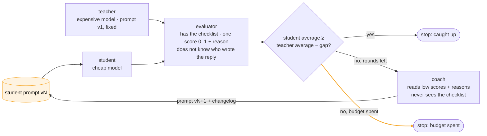

# hello-world-continual-learning

This is a small, runnable example of continual learning for an LLM agent. A cheap model learns to do
a support job as well as an expensive one, and the only thing that changes between rounds is the
cheap model's prompt. You can read the whole thing in an afternoon and run it for the price of a
coffee.

## What this is

Two models run the same customer-support agent on the same four tickets. The expensive model is the
teacher and the cheap model is the student. After every round an evaluator reads each reply, gives
it one score from 0 to 1, and writes down why. A coach then reads the student's low scores and the
evaluator's reasons and writes the student a new prompt. The round runs again with that prompt.

The loop stops when the student's average score is within a small gap of the teacher's, or when the
round budget runs out. Every run is saved, so you can open it later in the terminal or in the browser
without paying for a single model call.

## Why I built it

When people say an agent "learns in production", they usually do not mean fine-tuning. They mean a
loop: the agent does its job, something grades the result, something changes the agent's
instructions, and the agent runs again. That loop is described in every talk about AI agents, but
it is hard to watch one end to end, because in a real system it is spread across thousands of runs
and several teams.

This repo is that loop at the smallest size where the effect is still visible. Four tickets, two
models, one prompt that changes. You see the prompt go from v1 to v2 to v3, and for every score you
can read the reply and the reason it got that score, so when the student improves you know why, and
when it gets worse you know why too.

The hard parts are in here as well. The coach can make the student worse, the evaluator is noisy,
and the teacher has bad rounds of its own. The run further down shows all three.

## How it works



The teacher is the expensive model running the task's original prompt. Its prompt never changes,
because it is the reference; the bar the student has to reach is the teacher's average score over
all rounds so far, so one unusually good or bad teacher round does not move the target.

The student is the cheap model running the same agent on the same tickets. Between rounds the only
thing that changes is its prompt, which means that when its score moves you can attribute the move
to one specific edit.

The evaluator is a model that has the answer key. Every ticket ships with a checklist of what a good
reply must say, what it must not do, and which questions it has to answer. The evaluator reads a
reply against that checklist, gives it one score, and writes a paragraph explaining the score. It is
never told which model wrote the reply, so it cannot favour either side.

The coach is a model that sees the student's replies that scored below 0.7, the evaluator's reasons
for those scores, both prompts, and how every earlier prompt version scored. It never sees the
checklist, because a coach with the answer key would simply paste the answers into the prompt. It
returns the next prompt with a one-line note on what it changed and why.

Every model is a plain [LiteLLM](https://docs.litellm.ai) string in `config.yaml`. This example
uses Anthropic models (Claude Sonnet as teacher, evaluator and coach, Claude Haiku as student), and
moving any role to another provider is a one-line change.

## What you see


<table>
  <tr>
    <td width="50%"></td>
    <td width="50%"></td>
  </tr>
  <tr>
    <td align="center"><sub>Clicking any score opens the ticket's trap, the checklist a good reply has to satisfy, the evaluator's reason, the student's reply, and the teacher's reply to the same ticket.</sub></td>
    <td align="center"><sub>The terminal shows the same run: <code>prompt-coach run</code> prints the score table, one bar per round for each model, and the reason the loop stopped.</sub></td>
  </tr>
</table>

## Running it

You need Python 3.11 or newer, [uv](https://docs.astral.sh/uv/), and an Anthropic API key.

```bash
git clone https://github.com/komodorio/hello-world-continual-learning && cd hello-world-continual-learning
uv sync
cp .env.example .env                 # put ANTHROPIC_API_KEY=... in it

uv run prompt-coach cases            # the four tickets, the trap in each, and what a good reply must contain
uv run prompt-coach run              # the loop, in the terminal
uv run prompt-coach serve            # the same loop in the browser at http://127.0.0.1:8000
```

A full run is about 18 model calls per round and usually stops after two to five rounds. These are
the variants you will want after the first run:

```bash
uv run prompt-coach run --case refund --case compensation --rounds 3   # a subset of tickets and a shorter budget
uv run prompt-coach test --case refund                                  # one model, one ticket, one verdict
uv run prompt-coach test --case refund --agent teacher --prompt my.md   # try a prompt you wrote yourself
uv run prompt-coach replay runs/<id>.json                               # re-render a saved run, no model calls
uv run prompt-coach replay runs/<id>.json --round 3 --case refund       # the full replies and reasons for one cell
```

The command-line tool is called `prompt-coach`. The web page talks to a small API that is documented
at `/docs` while `serve` is running.

## One real run, explained

This run used Claude Sonnet as the teacher and Claude Haiku as the student, on all four tickets,
with a gap of 0.1 and a budget of five rounds.

| round | student prompt | teacher | student | what happened |
|---|---|---|---|---|
| 1 | v1 (same as teacher) | 0.93 | 0.69 | The student got the policy decisions right but dropped required details and ran over the word limits. |
| 2 | v2 | 0.93 | 0.66 | The coach added rules about checking eligibility dates. The student over-applied them. |
| 3 | v3 | 0.95 | 0.59 | The refund ticket fell to 0.10: the student refused a refund the policy clearly allows. |
| 4 | v4 | 0.95 | 0.77 | The coach saw two regressions in its history and replaced the date rule with "quote the policy's timing verbatim". |
| 5 | v5 | 0.77 | 0.84 | The student caught up. The teacher had a weak round; the stop rule uses its 0.90 average. |

In round one both models had the same prompt, so the difference between 0.93 and 0.69 is the
difference between the models. The evaluator's recommendation to the coach after that round said the
student "consistently identifies the right policy and mechanics but loses points through incomplete
execution", which is a fair summary of what a cheap model does with a thin prompt.

Rounds two and three are the reason this repo exists. The coach's new prompt looked sensible: it told
the student to check eligibility dates before answering. Haiku followed that instruction too hard,
told the customer she was "beyond the 7-day window" when she was not, and refused a refund the policy
allows. The score for that ticket went from 0.85 to 0.35 to 0.10. If you had shipped v2 because it
read better than v1, you would have made the agent worse and not known it, because nothing in the
prompt text tells you that. The score does.

Round four is where the coach earned its place. It could see that v2 and v3 both scored below v1,
so instead of adding another rule it deleted the one that caused the damage and replaced it with an
instruction to quote the policy's timing in the policy's own words rather than deriving new dates.
The student recovered to 0.77, then 0.84. The prompt that finally worked is shorter than the two
that failed.

Round five also shows why the stop rule compares against the teacher's average and not against the
current round. The teacher itself dropped to 0.77 that round, on two tickets it normally gets right.
Measured against that one round the student would have "won" by luck; measured against the 0.90
average it caught up on merit, and that is what the loop reports.

Two details about the coach matter here. The first version of it could not see how earlier prompts
had scored, and it behaved the way you would expect: it added rules every round, the prompt grew from
352 to 486 to 553 words, and the student got worse every round. Giving the coach the score history
of its own versions, plus a hard cap of 300 words on the prompt, is what made it converge. Not every
run does converge. Another run with the same settings went 0.72, 0.68, 0.68, 0.49 and spent its
budget without catching up, and the run cards in the web page show that as plainly as this one.

## The four tickets

The tickets are for a fictional coffee roaster. Each one is a customer message plus the policy
snippet that applies to it, and each snippet hides one thing a cheap model tends to get wrong.

- **refund**: the customer is 38 days past delivery, so the 30-day rule says no, but a 60-day
  guarantee for defective items says yes. She also asks where the money goes when half was paid with
  a gift card.
- **two-questions**: the customer wants to cancel and to export his order history in the same
  message, and a 3-day notice rule means he is still charged once more. Weak replies answer one of
  the two requests or promise he will not be charged.
- **missing-feature**: Sunday delivery and Sunday pickup do not exist, and support cannot see stock.
  Weak replies invent an option or send the customer to a competitor instead of offering Saturday
  pickup.
- **compensation**: an angry customer demands a refund and a free month. Policy allows a 10% credit,
  the reply has to stay under 80 words, and the agent must not offer escalation unless asked.

`prompt-coach cases` prints each ticket with its trap and the checklist a good reply has to satisfy.
In the browser, the `?` next to each case opens the same thing.

## Using your own task

A task is a folder. `task.yaml` holds the prompt both models start from, the output-format rules,
and a paragraph of guidance for the evaluator. Each file in `cases/` holds one ticket: a `trap` (one
line, for humans), the `input` the agent sees, and the `expected` checklist the evaluator scores
against. Point `task:` in `config.yaml` at your folder, or pass `--task`. Nothing outside
`tasks/support/` knows anything about coffee.

A case earns its place when its trap catches the cheap model on the first round and its checklist is
specific enough that two people would give the same reply the same score.

## Swapping models

```yaml
models:
  teacher: anthropic/claude-sonnet-5
  student: anthropic/claude-haiku-4-5-20251001
  # student: openrouter/moonshotai/kimi-k2      # any LiteLLM provider works; the key goes in .env
  evaluator: anthropic/claude-sonnet-5
  coach: anthropic/claude-sonnet-5
```

The experiments worth running are a student from a different model family, an evaluator from a third
family so it has no house taste, and a coach that is weaker than the evaluator.

## What this does not do

With four tickets, one evaluator wobble of 0.1 on one ticket moves the average by 0.025, and one
weak teacher round moves the bar. The loop guards against that by comparing with the teacher's
average over rounds, by refusing to declare the gap closed before round two, and by using a gap of
0.1, which is wider than the noise. Even so, read the per-ticket grid and not only the average: a
student at 0.79 overall can still be at 0.50 on one ticket.

The evaluator is one number from a language model, anchored to a checklist. The same reply usually
lands within 0.1 of itself on a second grading, which is good enough to see a trend and not good
enough to treat as a unit test. The written reasons are the part to trust.

The coach optimises against these four tickets and nothing else, so a prompt that scores well here
may be fitting these tickets. The prompts it writes are general, with no customer names, dates or
figures in them, but this repo cannot prove they generalise. Adding cases is the fix.

Only the student's prompt changes. There are no tools, no retrieval and no fine-tuning, because the
point is to see one lever move.

## Under the hood

```
tasks/support/     task.yaml and cases/*.yaml, the example task
src/prompt_coach/
  roles/           agent.py, evaluator.py, coach.py
  loop.py          one round: run both models, grade every reply, stop or call the coach
  runs.py          runs/<id>.json and replay
  cli.py           cases, run, test, replay, serve
  web/             a FastAPI backend and one static page; live updates over SSE; OpenAPI at /docs
  llm.py           the one function that calls a model, which the tests replace with a fake
tests/             48 offline tests with a fake model, and one live test you opt into
```

The agents run on Google ADK over LiteLLM. The evaluator and the coach are single model calls whose
prompts live in `src/prompt_coach/prompts/`. The loop produces a stream of events, and the terminal
and the web page are two renderers of that same stream.

```bash
uv run pytest                 # offline, about one second
uv run pytest -m live         # one real call per role; needs ANTHROPIC_API_KEY
```

MIT licensed.
