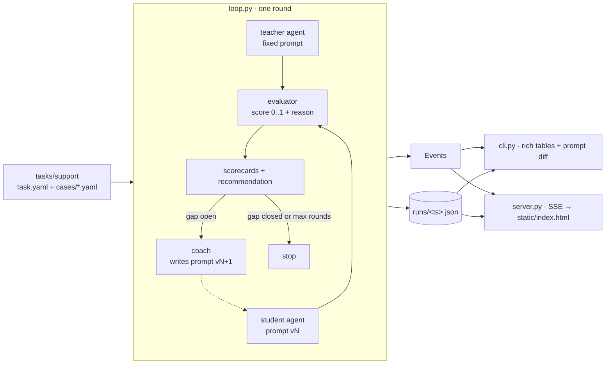
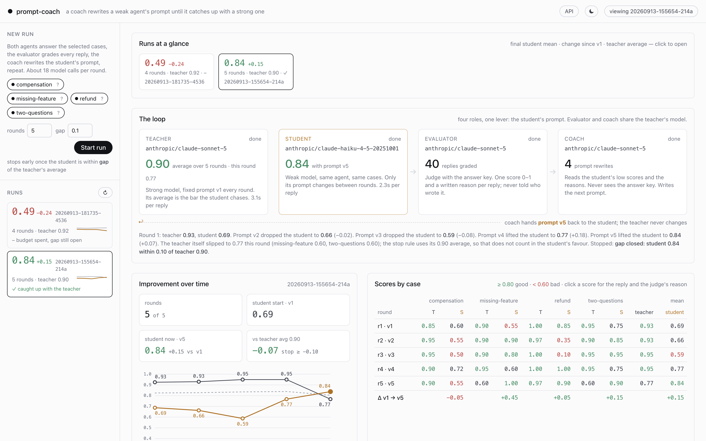

# prompt-coach

**A hello-world for continual learning of LLM agents.** A strong model and a weak model run the same
tiny support agent on the same four customer tickets. An evaluator grades every reply with one score.
A coach reads the weak model's failures and rewrites only its prompt, and the loop repeats until the
weak model is within a hair of the strong one.


## The story

Most of what people call "continual learning" for agents is not gradient descent. It is a loop that
runs in production: an agent does its job, something measures how well it did, and something else
changes the agent so it does better next time. The change is usually to the *instructions*, because
that is the lever you can pull without retraining anything. This repo is that loop, reduced to the
smallest version that still shows the effect.

There are four characters.

The **teacher** is a strong model (Claude Sonnet here) running a support agent with a plain prompt:
*"You are a support agent for Beanhouse, a small online coffee roaster. Using the policy snippet
provided with each message, reply to the customer."* It reads a ticket, reads the policy that applies,
and writes a reply. It does this well, most of the time.

The **student** is a weak model (Claude Haiku here) running the *same* agent with the *same* prompt.
On round one it stumbles in familiar ways: it runs over the word limit, it promises the parcel "will
be replaced" when the policy says "after an investigation", it forgets the one alternative the policy
actually allows, it answers one of two questions.

The **evaluator** is a judge with the answer key. Every ticket ships with an `expected` checklist:
what a perfect reply must say, must not do, and must answer. The judge reads a reply against that
checklist and returns a single number from 0.0 to 1.0 plus a paragraph explaining it. It never learns
which model wrote the reply. Per round, each agent's scorecard is just the mean over the four tickets.

The **coach** never sees the answer key. It sees the teacher's prompt, the student's current prompt,
the student's replies that scored badly, the judge's reasons, and a short recommendation summarising
the pattern. Its job is to rewrite the student's prompt so the *pattern* stops, not to smuggle in the
answers. It returns prompt v2 with a one-line changelog.

Then round two: the teacher runs again with its fixed prompt, the student runs with v2, the judge
grades both, and the loop either stops (student mean within `gap = 0.1` of the teacher's) or the coach
writes v3. The loop closes because every round produces something the next round consumes: replies
become scores, scores become reasons, reasons become a new prompt, the new prompt becomes new
replies. Only one thing changes between rounds, so when the student improves you know why.

## The four tickets

All four are support tickets for a fictional online coffee roaster. Each is a customer message plus
the policy snippet that applies, and each snippet hides a trap.

**refund** — Dana ordered beans 38 days ago, opened them this week, and they are stale. The policy
says no refunds after 30 days and no change-of-mind refunds on opened bags; buried after that is a
60-day freshness guarantee for defective product, conditional on a photo. A flat "no" is wrong, an
unconditional "yes" is wrong, and she also asks where the money goes back to when she paid half with
a gift card.

**two-questions** — Tom wants to cancel his subscription *and* get a CSV of his order history. The
policy says cancellations less than 3 days before the billing date apply to the following period, and
he is writing 2 days before. The trap is answering only one request, or telling him he will not be
charged again when he will.

**missing-feature** — Priya wants Sunday delivery for brunch and asks if she can pick up on Sunday
instead, and whether a bean is back in stock. The shop does neither on Sundays, agents have no stock
data, and it is Friday afternoon past the shipping cutoff. The trap is inventing a service that does
not exist, or sending her elsewhere instead of offering the Saturday pickup that does.

**compensation** — Marcus is angry: a missed delivery ruined a client tasting and he wants a full
refund and a free month, in under 80 words. The policy allows a 10% credit, only once he replies with
the words "late delivery", and says not to offer escalation unless asked. The trap is promising what
you cannot, going cold, or going long.

## How the pieces fit



Agents are Google ADK `LlmAgent`s over a LiteLLM model adapter, so any model with a LiteLLM string
works. The evaluator and coach are plain LLM calls with a system prompt (`prompts/evaluator.md`,
`prompts/coach.md` inside the package). Everything the loop does is expressed as `Event`s; the
terminal and the web page are two renderers of the same stream, and every round is appended to a JSON
file so you can replay a run without spending a token.

## Quickstart

You need Python 3.11+, [uv](https://docs.astral.sh/uv/), and an Anthropic API key (or any key
LiteLLM understands, if you swap the models).

```bash
git clone https://github.com/itielshwartz/prompt-coach && cd prompt-coach
uv sync
cp .env.example .env            # put ANTHROPIC_API_KEY=... in it
# config.yaml is committed and already points at Sonnet (teacher, judge, coach) and Haiku (student)

uv run prompt-coach cases        # read the 4 tickets: the trap in each, and what a good reply must contain
uv run prompt-coach run          # the whole loop, in the terminal
uv run prompt-coach serve        # then open http://127.0.0.1:8000  (API docs at /docs)
```

The CLI is one command with five verbs — `cases`, `run`, `test`, `replay`, `serve` — and `--help` on
each. `run` takes `--case <id>` (repeatable) to work on a subset, `--rounds N` and `--gap X` to change
the stop rule. After every round it prints the score table, a bar chart of the student's mean per
round next to the teacher's, the evaluator's brief, and the diff of the new prompt; at the end, the
best-scoring prompt.

`serve` gives you the same loop in a page, in light or dark. Pick cases (the `?` on each shows its
trap and what a good reply must contain), start, watch the four roles work, see the student's mean
climb round by round, and click any score to read the checklist, the judge's reason, the student's
reply and the teacher's reply to the same ticket, with arrow keys to step through rounds. Every saved
run shows up as a card with its final student score, the change since v1, the teacher's average and
whether it caught up.
It binds to 127.0.0.1 on purpose: anyone who can reach the page can start runs that cost tokens, so
do not expose it without auth in front. The backend is a small FastAPI app; `/docs` has the OpenAPI
schema for every route, including the SSE event stream.


The page has a light theme too (the toggle in the header; it follows your system setting by default):



## What you'll see

This is one real run, five rounds, trimmed. Round one, the same prompt on both models:

```
      Round 1 · student prompt v1
┏━━━━━━━━━━━━━━━━━┳━━━━━━━━━┳━━━━━━━━━┓
┃ case            ┃ teacher ┃ student ┃
┡━━━━━━━━━━━━━━━━━╇━━━━━━━━━╇━━━━━━━━━┩
│ compensation    │    0.85 │    0.60 │
│ missing-feature │    0.90 │    0.55 │
│ refund          │    1.00 │    0.85 │
│ two-questions   │    0.95 │    0.75 │
├─────────────────┼─────────┼─────────┤
│ mean            │    0.93 │    0.69 │
└─────────────────┴─────────┴─────────┘
```

The evaluator's brief to the coach, in its own words: *"The student consistently identifies the right
policy and mechanics but loses points through incomplete execution: leaving required elements
implicit rather than stated … dropping specific required details (the 5-day investigation window, the
60-day-and-7-day dual eligibility condition) … and in one case outright omitting the single most
useful policy option (Saturday pickup) in favor of a useless alternative. … The teacher's edge isn't
different policy knowledge — it's completeness and precision."*

Then the interesting part. The coach's v2 and v3 made the student *worse*: 0.69 → 0.66 → 0.59. Both
versions added rules about checking eligibility dates, and Haiku over-applied them, telling Dana she
was "beyond the 7-day window" and refusing a refund the policy clearly allows (refund fell to 0.35,
then 0.10). The coach saw the two regressions in its history, threw the date-checking rule out and
replaced it with "quote the policy's timing verbatim, don't derive new specifics". v4 took the student
to 0.77 and v5 to 0.84, with refund back at 1.00 and 0.90.


Round 5 also shows why the stop rule compares the student to the teacher's *average* over rounds
rather than to the current round: the teacher itself had a bad round (0.77), and against that alone
the student would have "won" by luck. Against the 0.90 average it closed the gap on merit.

A prompt change is a hypothesis. The judge is how you find out. Without a scored loop you would have
shipped v2 and called it an improvement.

The CLI reports the *best-scoring* version, not the last one tried, since a later prompt is not always
better. Here they coincide. The final prompt is general — nothing in it names a customer, a date, or a
policy figure — and it is shorter than the two versions that failed:

```
You are a support agent for Beanhouse, a small online coffee roaster. Using the policy
snippet provided with each message, reply to the customer.

State only what the policy actually says. When a rule names specific days, hours, or
cutoffs, repeat them in the policy's own terms rather than calculating a new date or time
yourself. If you must combine two policy facts to answer, only do so when the result is
certain and simple - otherwise state each fact plainly and let the customer work out the
rest, rather than inventing a specific figure.

Answer every question the customer asked. When declining something, name the nearest
option the policy does allow, described exactly as the policy describes it - exact figures
and conditions, never paraphrases or approximations.

If the customer expresses frustration, urgency, or names a specific problem, open with one
short phrase acknowledging that specific thing, not a generic pleasantry.

Word limits are firm. Keep sentences tight; if a reply would run long, cut background or
repeated explanation first, never a required fact or answer.

Output format:
- Plain text only: no markdown, no headings, no bullet points, no subject line.
- Open with a greeting that uses the customer's first name.
- Sign off with exactly: "Maya, Beanhouse Support".
- Stay under 120 words, or under the tighter limit if the ticket or policy specifies one.
```

Runs differ. Other runs went 0.72 → 0.64 → 0.79 in three rounds, and 0.76 → 0.60 → 0.91 against a
teacher at 0.96. See "Known limits" for why.

## Swapping models

Every model is one LiteLLM string in `config.yaml`, and the key comes from `.env`:

```yaml
models:
  teacher: anthropic/claude-sonnet-5
  student: anthropic/claude-haiku-4-5-20251001
  # student: openrouter/moonshotai/kimi-k2   # e.g. Kimi via OpenRouter, with OPENROUTER_API_KEY in .env
  evaluator: anthropic/claude-sonnet-5
  coach: anthropic/claude-sonnet-5
```

The interesting experiments are all here: a student from a different family, a judge from a third
family so it has no house taste, or a coach weaker than the judge. If a model refuses a parameter (the
newer Claude models reject `temperature`), the project does not set one.

## Adding your own task

A task is a folder. `task.yaml` holds the shared prompt v1, the output-format rules that get appended
to it, and a paragraph of grading guidance for the judge. `cases/*.yaml` each hold an `input` (what the
agent sees, all context inline, no tools) and an `expected` checklist (what the judge is anchored to).
Point `task:` in `config.yaml` at the folder, or pass `--task path/to/folder`.

```yaml
# tasks/my-task/cases/example.yaml
id: example
input: |
  Customer message: ...
  Policy snippet: ...
expected: |
  Must say:
  - ...
  Must not:
  - ...
  Must answer:
  - ...
```

Two things make a case useful. The input has to carry a trap a weak model actually falls into
(a buried second question, an exception inside a rule, a number that needs one step of arithmetic,
a tight limit). And `expected` has to be specific enough that two people reading it would give the
same reply the same score. Nothing outside `tasks/support/` knows about coffee.

## Testing one case

When one ticket keeps failing you do not want to pay for a full round. `test` runs one agent on one
case and grades it, with an optional prompt file and model override:

```bash
uv run prompt-coach test --case refund
uv run prompt-coach test --case refund --agent teacher
uv run prompt-coach test --case refund --prompt my_prompt.md --model openrouter/moonshotai/kimi-k2
uv run prompt-coach replay runs/<id>.json                 # re-render a saved run, no tokens
uv run prompt-coach cases --case refund --full            # one ticket in full: trap, message, policy, checklist
uv run python -m prompt_coach.smoke                      # raw replies from both agents, no grading
```

The web page has the same thing in its bottom-left panel, with a button that pastes in the latest
coached prompt.

## Cost per loop

One round is 4 cases × 2 agents = 8 agent calls, 8 judge calls, 1 recommendation and, unless it is
the last round, 1 coach call: up to 18 calls. Roughly 25–35k input tokens and 4–6k output tokens per round, mostly on the judge and
coach. A 3-round run is under 60 calls; at Sonnet-class prices that is on the order of a few tens of
cents. `runs/` keeps everything, and `replay` is free.

## Known limits

**Four cases.** With four scores, one judge wobble of 0.1 on one case moves the mean by 0.025, and
one real slip by the *teacher* moves the target the student is chasing. Three guards: the stop rule
compares the student to the teacher's mean *averaged over all rounds so far*, not to one lucky
round; the gap cannot close before round `min_rounds = 2`, so a weak teacher round 1 never ends
the loop before any coaching happened; and `gap = 0.1` is deliberately wider than the noise. You will still see the gap close in
two rounds some of the time and in four others. More cases smooth this; we kept four so a round stays
cheap and the whole run fits on one screen. The mean can also hide a bad case: a student at 0.79
overall may still be at 0.50 on one ticket, which is why the per-case grid, not the mean, is the
thing to read.

**Judge noise.** The score is a single number from an LLM. It is anchored to an explicit checklist
rather than taste, and the same reply will usually land within ±0.1, but it is not a unit test.
Read the reasons; they are the honest signal.

**Overfitting.** The coach sees the student's failures on these four tickets and writes a prompt to
fix them. There is no hold-out set, so a prompt that scores well here may be doing so by fitting these
tickets. The coach is told to fix patterns and never to embed facts, and the resulting prompts are
general, but "generalises" is a claim this repo cannot test. Add cases, or split them.

**One lever.** Only the student's prompt changes. No tools, no fine-tuning, no retrieval, no changing
the model. That is the point of a hello-world, and it is also why the student plateaus where it does.

## Running the tests

The tests run offline against a fake model that returns canned replies and judge JSON, so the whole
loop is exercised, including persistence, replay, the SSE stream and the coach's inputs, in about a
second:

```bash
uv run pytest
```

Exactly one test calls real models on one case. It is marked `live`, deselected by default, and skips
itself when `ANTHROPIC_API_KEY` is unset:

```bash
uv run pytest -m live
```

## Layout

```
config.example.yaml  .env.example  tasks/support/{task.yaml,cases/*.yaml}
src/prompt_coach/
  types.py      Case, Record, Verdict, Scorecard, PromptVersion, RoundResult, Event
  agent.py      Agent over ADK LlmAgent + LiteLlm (all ADK plumbing lives here)
  models.py     the one place that calls LiteLLM; tests fake this
  task.py       load_task(folder, case_ids)
  evaluator.py  grade(record, case) -> Verdict;  recommend(teacher, student) -> str
  coach.py      propose(...) -> PromptVersion v+1
  loop.py       run_loop(config, task) -> AsyncIterator[Event];  save/load/replay runs
  cli.py        prompt-coach cases | run | test | replay | serve
  server.py     FastAPI: / /cases /start /test /events /runs /runs/{id}  (OpenAPI at /docs)
  static/index.html   the page; vanilla JS, no build step
  prompts/{evaluator,coach}.md
  smoke.py      both agents on all cases, replies only
tests/          FakeModel fixture + one live test
```

MIT licensed.
