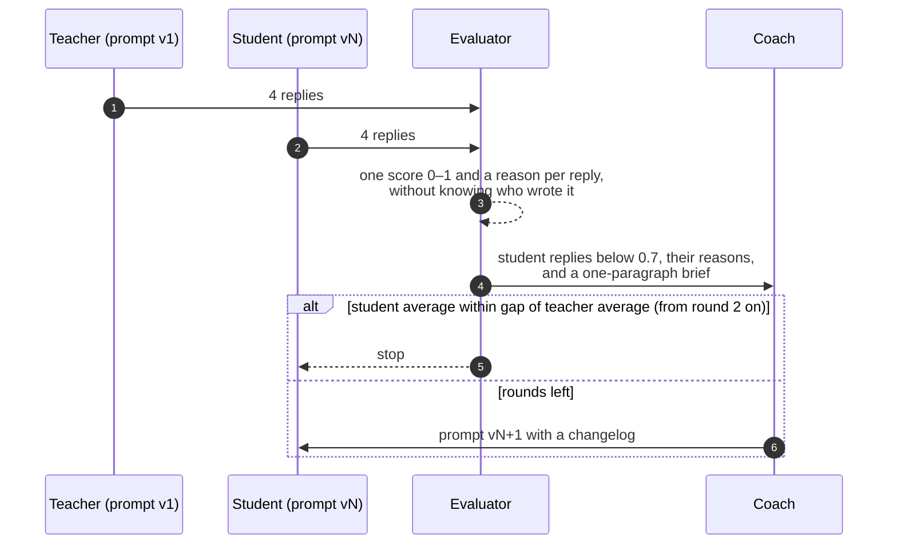

# hello-world-continual-learning

This is a small, runnable example of continual learning for an LLM agent. A cheap model learns to do
a support job as well as an expensive one, and the only thing that changes between rounds is the
cheap model's prompt. The code fits in an afternoon of reading and a run costs a few dollars in
model calls.

The job is customer support for an online store. A customer writes in, the agent gets the message
and the one policy snippet that applies to it, and the agent writes the reply. The tickets are the
ones every store gets: a refund request just past the return window, a cancellation and a data
export in the same message, a delivery slot that does not exist, an angry customer who wants more
than policy allows. Each one has a detail that a cheap model tends to get wrong, and a checklist of
what a good reply has to contain, so a reply can be scored and the score can be explained.

## What is in it

- **Task**: the support desk of Loomi, a fictional online store for home goods. One folder with the
  starting prompt, the output-format rules, and the test cases.
- **Test cases**: four customer tickets. Each one is a customer message plus the policy snippet that
  applies to it, a `trap` (the thing a cheap model tends to get wrong), and an `expected` checklist
  of what a good reply must say, must not do, and must answer.
- **Teacher**: the expensive model (Claude Sonnet here) running the task's starting prompt. Its
  prompt never changes; its average score is the target.
- **Student**: the cheap model (Claude Haiku here) running the same agent on the same tickets. Its
  prompt is the only thing that changes between rounds.
- **Evaluator**: a model that has the checklist. It reads a reply, gives it one score from 0 to 1,
  and writes a paragraph explaining the score. It is never told which model wrote the reply.
- **Coach**: a model that reads the student's low-scoring replies and the evaluator's reasons, and
  writes the student's next prompt. It never sees the checklist.
- **Round**: both models answer every ticket, every reply is scored, and the coach writes the next
  prompt if the loop is not done.
- **Run**: a sequence of rounds, saved as one JSON file, replayable in the terminal or the browser
  without any model calls.

Every model is a plain [LiteLLM](https://docs.litellm.ai) string in `config.yaml`, so any provider
works.

## How it works


1. A ticket comes in: the customer's message plus the policy snippet that applies to it.
2. Both agents answer it, the teacher with its fixed prompt and the student with its current one.
3. The evaluator reads each reply against the ticket's checklist and gives it a score and a reason.
4. After all four tickets, the student's average is compared with the teacher's.
5. If the student is still behind, the coach reads the low scores and the reasons and writes the
   student a new prompt. The next round starts with that prompt. When the student is close enough,
   or the round budget is spent, the loop stops.

## How it works, step by step

1. **Both models answer the same tickets.** The teacher runs with the task's prompt v1. The student
   runs with its current prompt version, which is v1 in the first round. Four tickets, two models,
   eight replies, all in parallel.
2. **The evaluator scores every reply.** For each reply it gets the ticket, the output-format rules,
   and that ticket's `expected` checklist. It returns one score in [0, 1] and a written reason. A
   wrong policy decision caps the score at 0.4; going over the word limit caps it at 0.6.
3. **The loop checks the stop rule.** The student's average for the round is compared with the
   teacher's average over all rounds so far. If the student is within `gap` (0.1 by default) and at
   least two rounds have run, the loop stops. If the round budget (5 by default) is spent, it stops
   too.
4. **The evaluator briefs the coach.** It compares the teacher and the student per ticket and writes
   one paragraph on the pattern behind the student's losses.
5. **The coach writes the next prompt.** It gets the teacher's prompt, the student's current prompt,
   the student's replies that scored below 0.7 with the evaluator's reasons, the brief, and how
   every earlier prompt version scored. It returns prompt vN+1 with a one-line changelog, under a
   hard cap of 300 words. It never sees `expected`.
6. **The round is saved and the next one starts** with the student on the new prompt. The teacher's
   prompt, the tickets and the models stay the same.



## What you see


The page shows one run. At the top, the four role cards tell you which model plays each role and its
current score. The chart underneath is the student's average per round next to the teacher's, with
the dashed line marking where the loop is allowed to stop. The grid on the right has one row per
round and one column per ticket, teacher and student side by side, so you can see which ticket moved
when the prompt changed. Below that are the prompt versions, with the coach's changelog and a diff
against the previous version, and the evaluator's brief to the coach.

<table>
  <tr>
    <td width="50%"></td>
    <td width="50%"></td>
  </tr>
  <tr>
    <td align="center"><sub>Clicking any score opens the ticket's trap, the checklist, the evaluator's reason, the student's reply, and the teacher's reply to the same ticket.</sub></td>
    <td align="center"><sub>The terminal shows the same run: <code>prompt-coach run</code> prints the score table, one bar per round for each model, and why the loop stopped.</sub></td>
  </tr>
</table>

Every score can be explained. In round one the student scored 0.15 on the refund ticket. This is
what it wrote to the customer:

> Thanks for reaching out. I'm sorry to hear two mugs arrived cracked. The good news is our damage
> guarantee covers this for 60 days from delivery, and you're well within that window. However, we
> do require damage to be reported within 7 days of unpacking, and you've just unpacked them 38 days
> after delivery. Unfortunately, this falls outside our 7-day reporting window, so I'm unable to
> process a claim under our damage guarantee.

And this is the evaluator's reason for the 0.15, lightly shortened:

> The agent misapplied the 7-day rule. Dana unpacked the mugs 3 days ago and reported immediately,
> which is within the 7-day-from-unpacking window; the 38 days refers to time since delivery, not
> since unpacking. The agent denied the damage guarantee claim entirely, which is a wrong policy
> decision and caps the score at 0.4. It also failed to ask for the photo, did not mention the
> 2-business-day processing time, and never offered the choice between refund and replacement.

The coach does not see the checklist, but it sees reasons like this one for every low score, plus a
one-paragraph brief from the evaluator. After round one the brief said the student "loses points on
missing required details that the teacher reliably includes … it misapplied the reporting-window
rule entirely, wrongly denying a valid claim", and asked the coach to make the student "verify
date/window calculations against the policy's actual reference point before applying rules".

## Running it

You need Python 3.11 or newer, [uv](https://docs.astral.sh/uv/), and an Anthropic API key.

```bash
git clone https://github.com/komodorio/hello-world-continual-learning && cd hello-world-continual-learning
uv sync
cp .env.example .env                 # put ANTHROPIC_API_KEY=... in it

uv run prompt-coach cases            # the four tickets, the trap in each, and what a good reply must contain
uv run prompt-coach run              # the loop, in the terminal
uv run prompt-coach serve            # the same loop in the browser at http://127.0.0.1:8000
```

A round is about 18 model calls, and a run usually stops after two to five rounds.

In the browser, the form at the top left is where you start a run. The chips are the tickets; click
one to leave it out, and click the `?` on a chip to read its trap and the checklist a good reply has
to satisfy. `rounds` is the budget and `gap` is how close the student has to get to the teacher's
average before the loop stops. Press *Start run* and the page fills in as the round goes: the four
role cards show who is working, the score grid gets a row per round, and the chart and the prompt
versions update when the round ends. Saved runs are listed under the form, each with its final
student score and whether it caught up; click one to open it.

```bash
uv run prompt-coach run --case refund --case compensation --rounds 3   # a subset of tickets, a shorter budget
uv run prompt-coach test --case refund                                  # one model, one ticket, one verdict
uv run prompt-coach test --case refund --agent teacher --prompt my.md   # try a prompt you wrote
uv run prompt-coach replay runs/<id>.json                               # re-render a saved run, no model calls
uv run prompt-coach replay runs/<id>.json --round 3 --case refund       # full replies and reasons for one cell
```

To use your own task, copy `tasks/support/`, edit `task.yaml` and the files in `cases/`, and point
`task:` in `config.yaml` at the new folder. To use other models, change the strings under `models:`
in `config.yaml` and put the provider's key in `.env`.

## One real run, and how the prompt changed

Claude Sonnet as teacher, Claude Haiku as student, all four tickets, gap 0.1, budget five rounds.
The loop stopped after three.

| round | student prompt | teacher | student | what the coach changed, and what happened |
|---|---|---|---|---|
| 1 | v1, 75 words, same as the teacher's | 0.89 | 0.52 | Refund 0.15 (wrongly refused a valid claim), missing-feature 0.35 (invented a delivery timeline, never offered Saturday pickup). |
| 2 | v2, 220 words | 0.87 | 0.59 | Added: cover every entitlement and next step, check which date each window counts from, never deny what the policy supports. Refund rose to 0.55, but three replies went over the word limit and were capped at 0.6. |
| 3 | v3, 230 words | 0.86 | 0.82 | Rewrote the same rules with a hard word cap: "cut wording rather than content". Refund 0.90, missing-feature 0.85, two-questions 0.98. Caught up. |

The student started with the teacher's prompt, word for word:

```
You are a support agent for Loomi, an online store for home goods.
Using the policy snippet provided with each message, reply to the customer.

Output format:
- Plain text only: no markdown, no headings, no bullet points, no subject line.
- Open with a greeting that uses the customer's first name.
- Sign off with exactly: "Maya, Loomi Support".
- Stay under 120 words unless the ticket or its policy states a tighter limit.
```

After round one the coach added one paragraph. The middle of it is aimed straight at the refund
mistake above:

```
Read date and window rules carefully: check exactly which event each window counts from
(delivery, unpacking, report date) before deciding if the customer qualifies - do not
assume the wrong reference point. If the customer qualifies for something, say so and
give the concrete next step (what to send, where, and the timeline); never deny a claim
that the policy's actual wording supports.
```

That fixed the decision and created a new problem: the student now wrote everything it was told to
include and ran to 124, 143 and 125 words on three tickets, so the evaluator capped those at 0.6.
The brief after round two said so in plain terms, and v3 kept the same rules but changed how they
are applied:

```
Cover every entitlement, choice, timeframe, and required next step the policy states, and
answer every question asked, but write as briefly as possible - use short sentences, no
repeated phrases, no restating what the customer already said. Never cut a required policy
detail just to save words; instead trim greetings, transitions, and closing remarks.
```

and the last format line became:

```
- Stay under 120 words unless the ticket or its policy states a tighter limit - treat this
  as a hard cap, not a target, and cut wording rather than content to meet it.
```

Three things are worth noticing. First, each version fixed what the previous round's reasons pointed
at, and each fix had a side effect that only the scores revealed; the v2 prompt reads like an
improvement, and on the mean it barely was. Second, the coach converged because it is shown how its
earlier versions scored, which is what stopped it from adding rules on top of rules; an early
version of the coach without that history grew the prompt to 553 words over three rounds while the
student got worse. Third, the target is the teacher's average across rounds (0.87), not the current
round, so a weak teacher round cannot end the loop on its own.

Not every run ends like this one. With the same settings on an earlier version of the tickets, one
run went 0.72, 0.68, 0.68, 0.49 and spent its budget without catching up. The run cards in the web
page show each saved run's final score and whether it caught up.

## Limits

Four tickets is enough to see the loop and not enough to trust an average: one evaluator wobble
moves it by 0.025. Read the per-ticket scores. The evaluator is a language model with a checklist,
so treat its scores as a trend and its written reasons as the signal. The coach optimises against
these four tickets and there is no hold-out set, so the prompts it writes may fit them; they contain
no customer names or figures, but this repo cannot prove they generalise. In this example we did
not change the model, add tool calls, add retrieval, or fine-tune anything; the student's prompt is
the only thing that changes, so that the effect of one lever is visible on its own.

## Under the hood

```
tasks/support/     task.yaml and cases/*.yaml
src/prompt_coach/
  roles/           agent.py, evaluator.py, coach.py
  loop.py          runs rounds until the stop rule fires
  runs.py          runs/<id>.json and replay
  cli.py           cases, run, test, replay, serve
  web/             FastAPI backend and one static page; OpenAPI at /docs
  llm.py           the one function that calls a model; tests replace it with a fake
tests/             48 offline tests, one opt-in live test
```

```bash
uv run pytest                 # offline, about one second
uv run pytest -m live         # one real student reply and one real grade; needs ANTHROPIC_API_KEY
```

MIT licensed.
