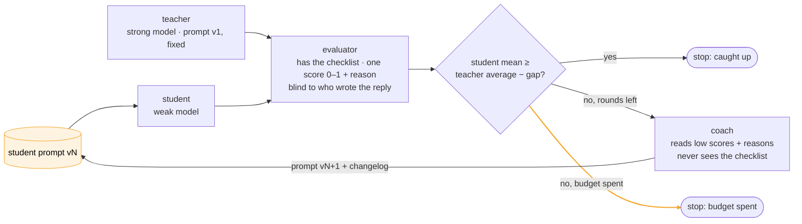

# hello-world-continual-learning

A small, runnable example of **continual learning for LLM agents**: a weak model learns to match a
strong one on a support task, and the only thing that changes between rounds is its prompt.

## What

Two models run the *same* customer-support agent on the *same* four tickets. A strong model is the
**teacher**; a weak, cheap model is the **student**. An **evaluator** scores every reply from 0 to 1
with a written reason. A **coach** reads the student's low scores and rewrites the student's prompt.
Then everything runs again. The loop stops when the student's mean score is within a small gap of
the teacher's, or when the round budget is spent.

You watch it from the terminal or from a small web page, and every run is saved so you can replay it
without spending tokens.

## Why

Most "continual learning" for agents in production is not fine-tuning. It is a loop: the agent works,
something grades the work, something changes the instructions, the agent works again. Everyone
describes that loop; almost nobody can watch one end to end. This repo is small enough to read in an
afternoon and cheap enough to run for the price of a coffee (about 18 model calls per round), so you
can see a prompt go v1 → v2 → v3 and read, for every score, *why* it moved.

It also shows the parts that are hard: the coach can make the student worse, the judge is noisy, the
strong model has bad rounds too. Those are in the run below, not hidden.

## How

Four roles, one lever. Only the amber arrow carries change.



- **Teacher** — the strong model with the task's original prompt. It never changes; its average
  score over rounds is the bar the student chases.
- **Student** — the weak model, same agent, same cases. Between rounds only its prompt changes.
- **Evaluator** — a model with the answer key: each ticket ships with a checklist of what a good
  reply must say, must not do, and must answer. One score per reply, plus a paragraph of reasoning.
  It is never told which agent wrote the reply.
- **Coach** — a model that sees the student's low-scoring replies, the judge's reasons, both prompts,
  and how earlier prompt versions scored. It never sees the checklist. It returns the next prompt
  with a one-line changelog.

Models are plain [LiteLLM](https://docs.litellm.ai) strings in `config.yaml`. This example uses
Anthropic (Claude Sonnet as teacher, judge and coach; Claude Haiku as student); swapping any role to
another provider is one line.

## What it looks like


<table>
  <tr>
    <td width="50%"></td>
    <td width="50%"></td>
  </tr>
  <tr>
    <td align="center"><sub>Click any score: the ticket's trap, the checklist, the judge's reason, the student's reply, and the teacher's reply to the same ticket</sub></td>
    <td align="center"><sub>Everything is also in the terminal: <code>prompt-coach run</code> prints the table, the progress bars and the stop reason</sub></td>
  </tr>
</table>

Light mode is one click in the header:


## Run it

You need Python 3.11+, [uv](https://docs.astral.sh/uv/), and an Anthropic API key.

```bash
git clone https://github.com/komodorio/hello-world-continual-learning && cd hello-world-continual-learning
uv sync
cp .env.example .env                 # put ANTHROPIC_API_KEY=... in it

uv run prompt-coach cases            # the 4 tickets: the trap in each, and what a good reply must contain
uv run prompt-coach run              # the loop, in the terminal
uv run prompt-coach serve            # the same loop in the browser: http://127.0.0.1:8000
```

Useful variants:

```bash
uv run prompt-coach run --case refund --case compensation --rounds 3     # a subset, shorter budget
uv run prompt-coach test --case refund                                    # one agent, one ticket, one verdict
uv run prompt-coach test --case refund --agent teacher --prompt my.md     # try your own prompt
uv run prompt-coach replay runs/<id>.json                                 # re-render a saved run, free
uv run prompt-coach replay runs/<id>.json --round 3 --case refund         # the terminal's "click a score"
```

The tool inside the repo is called `prompt-coach`; the web page's API is documented at `/docs`.

## One real run

Five rounds, four tickets, Sonnet as teacher, Haiku as student.

| round | prompt | teacher | student | what happened |
|---|---|---|---|---|
| 1 | v1 | 0.93 | 0.69 | Same prompt on both. Student misses details, runs over word limits. |
| 2 | v2 | 0.93 | 0.66 | Coach added rules about checking eligibility dates. Student over-applied them. |
| 3 | v3 | 0.95 | 0.59 | Worse again: the refund ticket fell to 0.10 (student wrongly refused a valid refund). |
| 4 | v4 | 0.95 | 0.77 | Coach saw two regressions in its history, dropped the date rule for "quote the policy's timing verbatim". |
| 5 | v5 | 0.77 | 0.84 | Caught up. Note the teacher's own bad round; the stop rule uses its 0.90 average, not this round. |

Two things in this run are the whole point:

1. **A prompt change is a hypothesis.** v2 and v3 looked reasonable and made the student worse.
   Without a scored loop you would have shipped v2 and called it an improvement.
2. **The coach needs its own history.** The first version of the coach could not see earlier scores;
   it stacked rules every round (352 → 486 → 553 words) and the student got worse every round. Given
   the score history and a hard word cap, it backed the bad rule out. The prompt that worked is
   shorter than the two that failed.

Runs differ. Another run went 0.72 → 0.68 → 0.68 → 0.49 and spent its budget without catching up;
the run cards in the UI show that as plainly as the good one.

## The four tickets

Support tickets for a fictional coffee roaster. Each is a customer message plus the policy snippet
that applies, and each hides one trap.

- **refund** — day 38, the 30-day rule says no, a 60-day defective-item guarantee says yes; she also
  asks where the money goes when half was paid by gift card.
- **two-questions** — cancel *and* export order history; a 3-day notice rule means he is still
  charged once more. Weak replies answer one request or promise no further charge.
- **missing-feature** — Sunday delivery and Sunday pickup do not exist; support cannot see stock.
  Weak replies invent an option or send the customer elsewhere instead of offering Saturday pickup.
- **compensation** — an angry demand for a refund and a free month; policy allows a 10% credit,
  under 80 words, no unprompted escalation.

`prompt-coach cases` prints each ticket's trap and the checklist a good reply must satisfy. In the
UI, the `?` next to each case opens the same thing.

## Adding your own task

A task is a folder: `task.yaml` (the shared prompt v1, the output-format rules, a paragraph of
grading guidance) plus `cases/*.yaml`, each with a `trap` (one line), an `input` (everything the
agent sees, inline) and an `expected` checklist (what the judge is anchored to). Point `task:` in
`config.yaml` at the folder or pass `--task`. Nothing outside `tasks/support/` knows about coffee.

A good case has a trap a weak model actually falls into and a checklist two people would score the
same way.

## Swapping models

```yaml
models:
  teacher: anthropic/claude-sonnet-5
  student: anthropic/claude-haiku-4-5-20251001
  # student: openrouter/moonshotai/kimi-k2      # any LiteLLM provider; key goes in .env
  evaluator: anthropic/claude-sonnet-5
  coach: anthropic/claude-sonnet-5
```

The interesting experiments: a student from another family, a judge from a third family so it has no
house taste, a coach weaker than the judge.

## Known limits

- **Four cases.** One judge wobble moves the mean by 0.025; one bad teacher round moves the bar.
  Guards: the stop rule compares against the teacher's *average* over rounds, cannot fire before
  round 2, and `gap = 0.1` is wider than the noise. Read the per-case grid, not just the mean.
- **Judge noise.** One number from an LLM, anchored to a checklist. Usually within ±0.1 on the same
  reply; not a unit test. The reasons are the honest signal.
- **Overfitting.** The coach optimises against these four tickets and there is no hold-out set. The
  prompts it produces are general (no customer names, dates or figures), but "generalises" is a
  claim this repo cannot test. Add cases.
- **One lever.** Only the student's prompt changes. No tools, no fine-tuning, no retrieval.

## Under the hood, briefly

```
tasks/support/     task.yaml + cases/*.yaml      the example task
src/prompt_coach/
  roles/           agent.py · evaluator.py · coach.py
  loop.py          one round: run both agents → grade → stop or coach
  runs.py          runs/<id>.json, replay
  cli.py           cases · run · test · replay · serve
  web/             FastAPI + one static page (SSE, light/dark, OpenAPI at /docs)
  llm.py           the one place that calls a model (tests fake this)
tests/             48 offline tests with a fake model; one opt-in live test
```

Agents run on Google ADK over LiteLLM. The evaluator and coach are single model calls with the
prompts in `src/prompt_coach/prompts/`. The loop yields events; the CLI and the web page are two
renderers of the same stream.

```bash
uv run pytest                 # offline, ~1 s
uv run pytest -m live         # one real call per role; needs ANTHROPIC_API_KEY
```

MIT licensed.
